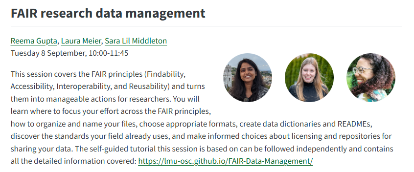
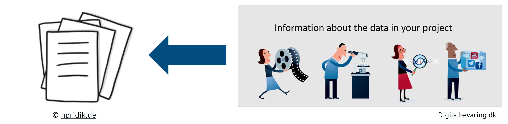
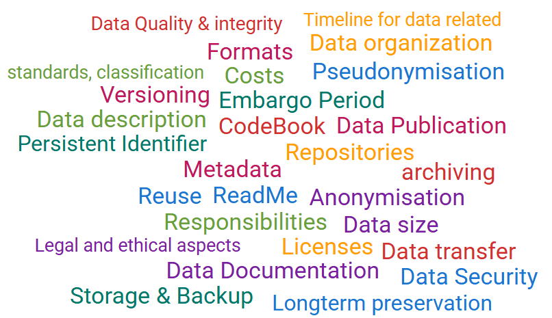
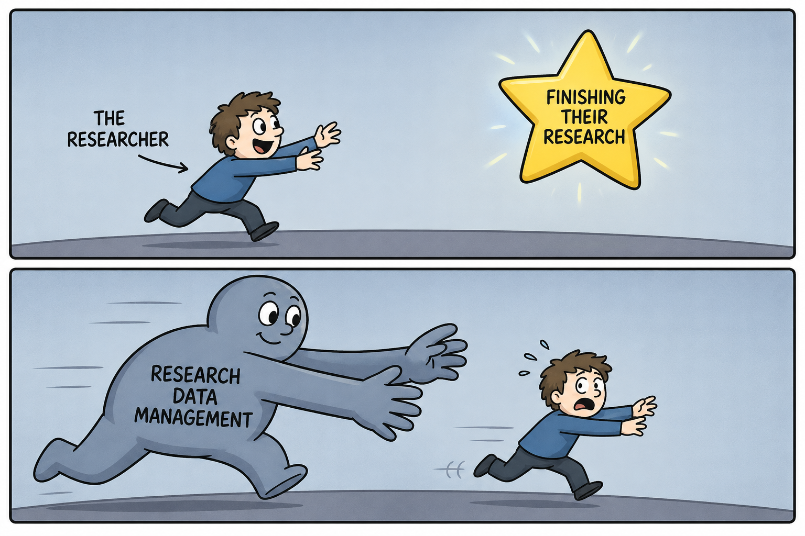
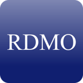
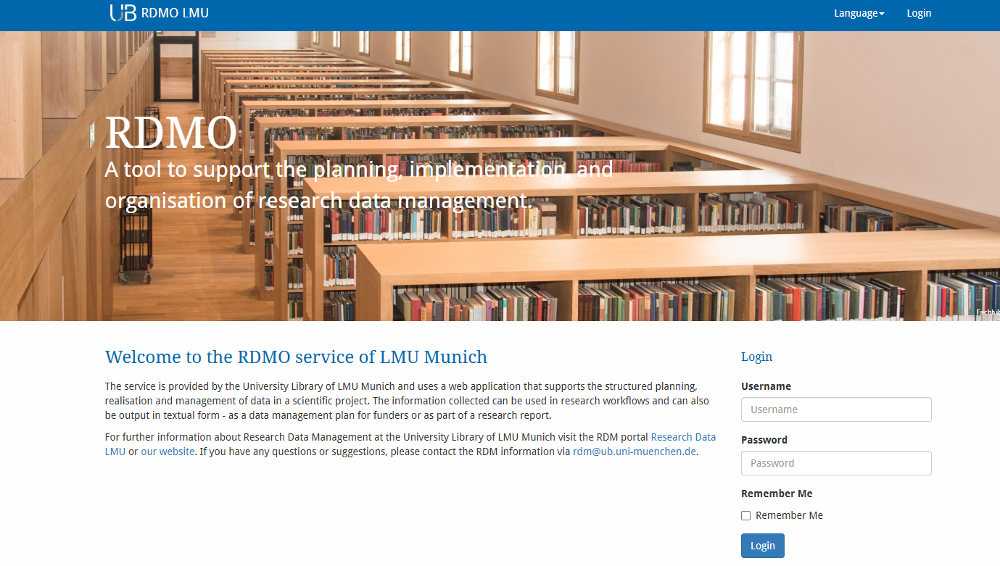
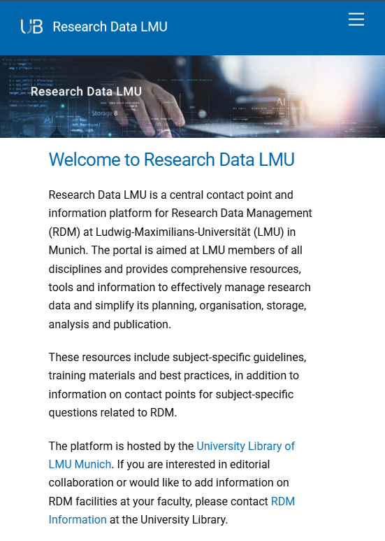
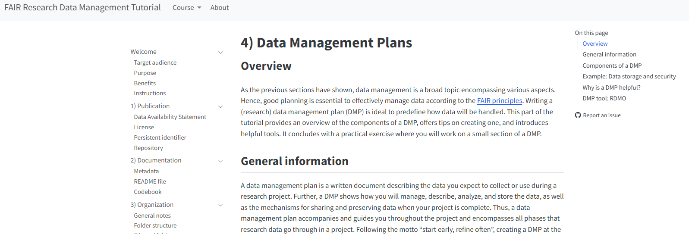

## Following on yesterday's FAIR session  {.center}

::: {.callout-tip .smaller}
#### Related Session Alert
Tuesday 8 September, 10:00 - 11:45: FAIR research data management ([TODO: Link to slides]) 
:::

## Recap: First Simple FAIR Checklist {.center}

::: {.centered-checklist}
::: {.columns .smaller}
::: {.column width="50%" .nonincremental .smaller .left-align}

#### Planning Phase (Findable + Reusable)
- [ ] Repository identified
- [ ] License selected (CC0/CC-BY)
- [ ] File naming conventions documented
- [ ] Folder structure planned
- [ ] Community standards identified

#### Active Research (Interoperable + Accessible) {.block-gap}
- [ ] README maintained with context
- [ ] Data dictionary created
- [ ] Metadata captured systematically
- [ ] Open formats used when possible
- [ ] Raw data preserved separately
:::

::: {.column width="50%" .nonincremental .smaller .left-align}
#### Pre-Publication (All FAIR principles)
- [ ] Documentation complete and clear
- [ ] Formats standardized for sharing
- [ ] Data uploaded to repository
- [ ] Metadata finalized
- [ ] Access permissions set

#### Publication (Findable + Accessible) {.block-gap}
- [ ] DOI assigned and verified
- [ ] ORCID profile updated
- [ ] Data Availability Statement (DAS) written
- [ ] All links functional
:::
:::
:::

## Today's Journey {.center}

. . .

*Mastering FAIR Research Data Management...* 

. . .

*...with the help of Data Management plans (DMP)*

## What we'll cover {.center}

- How to plan Data Management?
- Why bother planning your Data Management?
- Tools that support you in planning

. . .

::: {.callout-note icon=false}
## 🛠️ Tasks  
The session is mixed with **small exercises** and leaves time for you to **work on your own Data Management plan**.

**Engage actively**: Share your thoughts, ideas, and experiences. Your insights will help everyone learn.
:::

## Interactive elements: Particify  {.center}

:::: {.columns}
::: {.column width="50%"}
{width="65%"}
:::

::: {.column width="50%"}
 

**Join the interactive session:**

[partici.fi/36972724](https://partici.fi/36972724)

 

We'll use this for collaborative activities throughout the workshop. 
:::
::::

. . .

:::{.callout-tip title="Participation Options" .smaller}
Use an **alias name**, your **real name**, or **abstain** for polls/quizzes in Particify.
::: 

# Part I: How to plan Data Management? {.section-title  .part .center background-color="#0067ac"}

## What is a Data Management plan? {.center}

- Document that outlines how data will be handled during and after a research project
- Structures Data Management in a way that it is easier to keep track of it
- Not simply an administrative exercise

. . .

## Components of a DMP {.center}

::: {.img .center}

 by Jürgen Rohrwild](images/RD-Lifecycle.png)

:::

## Keywords for: Data Sharing {.center}

::: {.centered-checklist}
::: {.columns .smaller .nonincremental}
::: {.column width="20%" .nonincremental}
{.r-stretch}
:::

::: {.column width="35%" .nonincremental .left-align}
#### Access & Availability
- Ensure access
- Publication
- Ethical / legal restrictions
- Repositories

#### Conditions & Licensing {.block-gap}
- Licensing
- Embargo period
- Access restrictions 
:::

::: {.column width="35%" .nonincremental .left-align}
#### Content to Share
- Metadata
- Data files
- Documentation
- Code

#### Others {.block-gap}
- Responsibilities
- Timing
- Costs
:::
:::
:::

## What belongs in your DMP? {.center}

::: {columns}

::: {.column width="70%"}
::: {.left-align .callout-note icon=false}
## 🛠️ Task (~5 minutes)
Imagine you are about to start a new research project. For that you will create a Data Management plan that should cover all data related aspects of your project. In small groups, **brainstorm what should be included in this plan** - taking into account the specifics of your research discipline.
:::
::: {.smallest .center}
 by Jürgen Rohrwild](images/RD-Lifecycle.png){width="50%"}
:::
:::

::: {.column width="30%" .smaller .center}

Visit [partici.fi/36972724](https://partici.fi/36972724) to participate.
:::
:::

## DMP keywords {.center .img}

# Part II: Why bother planning your Data Management? {.section-title  .part .center background-color="#0067ac"}

## Avoid worst-case scenarios {.smaller .center}

](images/data-management-plan-with-text.jpg)

## Why should you care? {.center}

:::: {.columns .v-center-container}

::: {.column width="60%"}
::: {.incremental .left-align}
A DMP will

- clarify central aspects of RDM → **structure** for and optimization of Data Management
- support your own good scientific work → ensures that your data is **complete, accurate, trustworthy and FAIR**
- be a data guideline for the **entire course of the project** → "living document“
:::
:::

::: {.column width="40%" .smallest .block-gap}

:::

::::

## Funder requirements {.smaller-table .nonincremental .center}

| Funder | DMP demanded? | Submission on application? | Content | Updates?  |
|--------|---------------|----------------------------|---------|----------|
| European Commission / European Research Council, Horizon Europe            | Yes                               |      Yes + comprehensive plan within the first 6 month of the project   | [Template](https://ec.europa.eu/info/funding-tenders/opportunities/docs/2021-2027/common/agr-contr/general-mga_horizon-euratom_en.pdf) | Yes, in case of changes and at the end of the project | 
| German Research Foundation (DFG)            | Information on the handling of research data                |     Yes | [DFG Guidelines](https://www.dfg.de/en/basics-topics/basics-and-principles-of-funding/research-data), [DFG Checklist](https://www.dfg.de/resource/blob/174736/forschungsdaten-checkliste-en.pdf) | No |
| German Federal Ministry of Research, Technology and Space (BMFTR)                     | Depends on the programme      |      If required, yes | Depending on the programme; [Educational research: Checklist](https://www.forschungsdaten-bildung.de/files/fdbinfo_2.pdf) | Depends on the programme |
| Volkswagen Stiftung (VW Foundation)     | Yes   | Yes |  Template for a [Base-DMP](https://www.volkswagenstiftung.de/de/faqservice#download_formulare_berichte)    |  No (but considered a living document) |

::: {.smallest .nonincremental .left-align .block-gap}
Based on: 

- **Biernacka, K., et al. (2023).** Train-the-Trainer-Konzept zum Thema Forschungsdatenmanagement (Version 5). Zenodo. [https://doi.org/10.5281/zenodo.10122153](https://doi.org/10.5281/zenodo.10122153) 
- **Lehmann, S. B. C., et al. (2026).** Hilfestellung für den Beratungsalltag zu den Anforderungen wichtiger Fördermittelgeber in Deutschland und Europa bezüglich Forschungsdatenmanagement. Zenodo. [https://doi.org/10.5281/zenodo.18888078](https://doi.org/10.5281/zenodo.18888078) ​
:::

## Room for Improvement? {.center}

::: {.columns}
::: {.column width="70%"}
::: {.left-align .callout-note icon=false}
## 🛠️ Task (~5 minutes)
- **[DFG Checklist, section 1: Data description](https://www.dfg.de/resource/blob/174736/forschungsdaten-checkliste-en.pdf)**  
How does your project generate new data? Is existing data reused? Which data types (in terms of data formats like image data, text data or measurement data) arise in your project and in what way are they further processed? To what extent do these arise or what is the anticipated data volume?

- **Given answer in a DMP**: 
*“The sample data is recorded and organized with specific software. One to three GB of data is generated.”*

- **Now it is your turn: Is there anything to improve? Is there anything missing in this answer?**
:::
:::

::: {.column width="30%" .smaller .center}

Visit [partici.fi/36972724](https://partici.fi/36972724) to participate.
:::
:::

# Part III: Tools that support you in planning {.section-title  .part .center background-color="#0067ac"}

## Data Management plan tools {.center}

::: {.incremental .left-align}
- Software to create Data Management plans
- **Simplified workflow**, allows collaborative work
- **Project management tool** for handling research data
- No repository / storage solution: You cannot upload and store your data in a DMP tool
::: 

. . .

Example: [RDMO](https://rdmo.ub.lmu.de/) 

## Research Data Management Organiser (RDMO) {.center}

::: {.left-align}
- Online-Tool to create DMPs (Open Source) 
- DMPs are stored on local servers (by the LMU)

. . .

Features:

- Use existing **DMP templates** (called questionnaires)
- **Collaborative Work**: Rights- and role management
- **Import and export** DMPs → polished, funder-ready DMP
- **Snapshots**: Capture different versions of your DMP
:::

## Let's explore RDMO together {.center .smaller .nonincremental}

::: {.fragment  .nonincremental}
[{width=65% .border}](https://rdmo.ub.lmu.de/)
:::

[https://rdmo.ub.lmu.de/](https://rdmo.ub.lmu.de/)

## Now, it's your turn... {.center}

::: {.callout-note icon=false .left-align}
## 🛠️ Task (~20 minutes)
Use RDMO to start creating a Data Management plan — either for your own research project or for a fictional project you design together in your group.

1. Log in to RDMO: [rdmo.ub.lmu.de](https://rdmo.ub.lmu.de/)
2. Create a new project using the **European Research Council (ERC)** catalog.
3. Work through the questions, thinking carefully about:
    - **What types of data you will collect or generate?**
    - **Which file formats will be used?**
    - **How you will organize and name files?**
    - **What metadata and identifiers will you use?**
    - **Where to publish your data under which conditions?**
:::

# Wrap-Up: From Plan to FAIR {.section-title  .part .center background-color="#0067ac"}

## Planning is everything {.center}

#### ... is it?

- Try not to get lost in the details.
- Use the DMP as a management tool to keep an overview of your tasks.
- Update your DMP as you go - it's an evolving process and doesn’t need to include all details from the start.
- Take advantage of counseling services. 

## University library: RDM services {.center}

:::: {.columns .smaller}
::: {.column width="50%" .left-align}
**RDM information**: 

- First contact point for questions concerning Research Data Management (RDM)
- Services and infrastructures:
    - DMP tool: [RDMO](https://rdmo.ub.lmu.de/)
    - Electronic lab notebook: [eLabFTW](https://elab.ub.lmu.de/)
    - Repository for data publications: [Open Data LMU](https://data.ub.uni-muenchen.de/)
    - DOI registration, metadata support
    - Advice & training for all LMU members
- Contact via [rdm@ub.uni-muenchen.de](mailto:rdm@ub.uni-muenchen.de) or -3560
::: 

::: {.column width="10%"}
:::

::: {.column width="40%" .center}
::: {.fragment}
**Research Data LMU**: [https://fdm.ub.lmu.de/](https://fdm.ub.lmu.de/)
{width="70%" .border}
:::
:::
::::

## OPTIONAL Follow-Up {.smaller .center}

::: {.left-align}
The content of this session is part of the (self-guided) tutorial for [FAIR Research Data Management](https://lmu-osc.github.io/FAIR-Data-Management/).^[Kleemeyer, M., Leiminger, L., Meier, L. & Walter, D. (2024). FAIR Research Data Management Tutorial. [https://lmu-osc.github.io/FAIR-Data-Management/](https://lmu-osc.github.io/FAIR-Data-Management/)]

You can use it to review today’s material and access some questions and example answers from a DMP.
:::

{width="80%" align=center .border} 

## Thank You! Questions? {.section-title .center}

